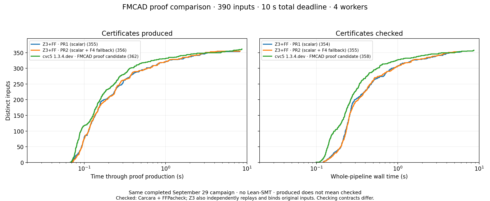
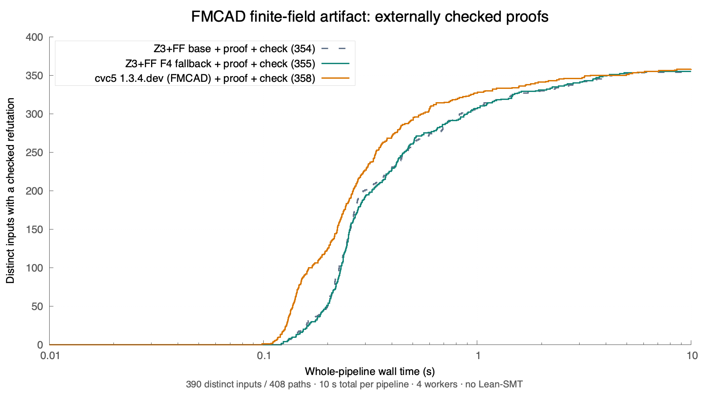

# F4 derivations through the existing Alethe/PAC pipeline

This change is based on `codex/qf-ff` at `4eda0e5ba`. It adds optional proof
recording to the fixed-width F4 backend and connects it to the existing
standalone certificate command and original-input Alethe/PAC checker pipeline.
The DAG format, PAC export rules and independent checkers are unchanged.

## What is certified

F4 records an input node for each original equation, a multiplication node
for each coefficient/monomial multiple, and an addition node for each row
subtraction. Initial normal-form reduction, matrix materialization, both
accumulator implementations and monic normalization retain these derivations.
Interned dense monomials are translated back to the original variable IDs.
A successful certificate derives the constant polynomial 1 from exactly the
original equations. Dependencies or an UNSAT status alone are never evidence.

Proof recording is optional during ordinary solving. In proof mode, the
backend stops after ideal reasoning: no sampled model, root split, field
closure, implicit disequality witness or cached basis becomes a proof input.
The existing input bridge introduces and checks disequality witnesses before
calling F4. Boolean resolution and ITE lemmas continue through the existing
Boolean pipeline. Independent replay binds the input, DAG and exact Alethe/PAC
bytes before external Carcara/FFPacheck acceptance is counted.

The caller's proof is replaced only on success. SAT/unknown, unsupported
arithmetic, cancellation and resource exhaustion cannot publish a partial DAG.
Proof storage is bounded to 100,000 nodes and an estimated 16 MiB; recording
and multiplier conversion consume the reconstruction's shared work allowance.

## Search controls

```smt2
(ff-certify :backend auto :timeout 10000)
(ff-certify :backend scalar :timeout 10000)
(ff-certify :backend f4 :timeout 10000)
```

`auto` preserves the existing scalar reconstruction and its conflict cores
when successful, then tries F4 after an unavailable scalar result. Both
attempts share the original work/cancellation budget; fallback never replenishes
spent work. A completely exhausted work allowance leaves no room for F4, but
a structural basis/DAG limit can leave enough budget for the alternate search. `scalar` retains the earlier search. `f4` forces F4 with the overall
reconstruction allowance and can report unavailable when scalar could succeed.
Fields unsupported by fixed-width arithmetic use the scalar fallback in auto.

The pipeline exposes the same choice as `--backend auto|scalar|f4`. Its auto
invocation omits the new command option so archived, pre-selector binaries
remain usable as benchmark baselines. Benchmark configurations can set
`certificate_backend` for an ablation without changing the proof format.

```sh
python3 scripts/ff_proof_pipeline.py problem.smt2 --out /tmp/ff-proof \
  --z3 build-ff-cmake/z3 --backend auto \
  --carcara /path/to/carcara --ffpacheck /path/to/ffpacheck
python3 scripts/ff_proof_pipeline.py --check --out /tmp/ff-proof \
  --carcara /path/to/carcara --ffpacheck /path/to/ffpacheck
```

## Scope boundaries

This is standalone reconstruction with proof-producing F4, not native Z3
`get-proof` support or complete certification of the optimized solver.
The uniqueness tactic and tiny-field search do not yet emit checked traces.
Some of their UNSAT answers can be reconstructed independently as ideal
contradictions, but that does not certify those algorithms' own execution.
Finite-field root/closure arguments, bit-uniqueness lemmas, UF/theory combination
and full solver proof composition remain follow-up work. No Lean checking is
claimed. A missing proof remains unavailable and is never counted as checked.

## Validation

* Native finite-field suite, including matrix-path derivation replay for three
  field sizes, nonconsecutive variable IDs, failure atomicity, cancellation,
  successful reuse and refusal of unproved root arguments.
* Forced F4 independent Python replay: 63 valid DAG/Alethe pairs across five
  arithmetic-width examples and 180 random systems with exhaustive oracles;
  all 106 satisfiable random systems correctly yield no refutation. A separate
  257-monomial regression exceeds the scalar basis bound and is independently
  certified by the automatic F4 fallback.
* Existing certificate tests: 96 accepted DAG/Alethe pairs and 28 rejected
  corrupt, wrong-input or truncated objects; budget and incremental recovery.
* External literal suite: 29 accepted and 25 rejected bundles. External Boolean
  suite: 30 accepted, 22 rejected, 575 Boolean search checks, deep/shared-DAG
  cases; the two existing unavailable exhaustive examples remain unavailable.
* Benchmark supervisor: five regressions, including descendant cleanup.

## FMCAD comparison

The same archived FMCAD artifact corpus is reused: **390 byte-distinct inputs**
from 408 listed paths. The final campaign has **1,170 fresh runs**, shuffled
across three configurations with four workers, a 10-second whole-pipeline
wall deadline, and sampled 16 GiB worker-tree memory accounting. The native
arm64 M2 Max host and pinned artifact checkers are those from the
[earlier comparison](QF_FF_FMCAD_CVC5_COMPARISON.md). Lean-SMT is not run.
The machine was not reserved exclusively; short validation runs also occurred.
These are local 10-second measurements, not the paper's 1,200-second results.

| Configuration | Checked / 390 | Weighted / 408 | Median successful time |
|---|---:|---:|---:|
| Pushed Z3+FF base (`4eda0e5ba`) | 354 | 372 | 0.269 s |
| Z3+FF with scalar-first/F4 fallback | **355** | **373** | 0.279 s |
| cvc5 1.3.4.dev, FMCAD artifact candidate | **358** | **376** | 0.243 s |

The new default preserves **all 354 base successes** and gains one. Their
354 common successful pipelines total **215.620 s versus 216.008 s** (+0.18%);
the median paired time ratio is **1.008**. All 354 Alethe files are byte-identical.
This supports comparable performance with improved coverage, not a speedup.
The gain is `compilation-deterministic-none-10v-064t-ff-zokref-255b-0s.smt2`:
the old polynomial reconstruction reports a budget failure; the new proof is
fully checked in 0.819 s. Three separate serial follow-ups confirm unavailable
3/3 for the base and checked 3/3 for the new version. They do not replace the
primary timing rows.

The new version produces 356 proofs and checks 355 within the total deadline;
the base produces 355 and checks 354. There are no process errors, invalid
proofs or external-checker rejections in the final campaign. All 31 unavailable
new-version results occur during production. Four new-version runs reach the
outer deadline, including one with a produced proof.

The artifact candidate remains ahead in checked coverage and runtime. Of the
343 shared candidate/new-version successes, its cumulative time is 148.567 s
versus 211.675 s for Z3 (1.425x), with a median paired ratio of 1.533. There are
12 Z3-only and 15 candidate-only checked cases. As in the earlier comparison,
Z3 additionally performs original-input binding and independent replay; the
candidate's result means acceptance by the artifact's checker pipeline with
its documented PAC-premise binding limitation. These contracts are not identical.



[Production/checking vector PDF](qf-ff-f4-certificates/production-and-checking.pdf).
The left panel measures successful production stages of these same runs:
355 base, 356 PR2 and 362 candidate certificates. The right panel counts only
complete checked pipelines: 354, 355 and 358. Production alone is not validation.
The pinned cvc5 1.3.3/1.4.0/main binaries reject the artifact's `--ff-proof-pac`
option; their ordinary-solving curves are not relabeled as certificate curves.

A [fresh split-bug proof audit](qf-ff-split-proof-audit/README.md) confirms that
the false-UNSAT reproducer does not yield a complete checked Alethe/PAC proof.
Plain internal checking still admits its trusted steps; complete-proof checking
rejects incompleteness, and Alethe export fails on unsupported operators.



[Vector PDF](qf-ff-f4-certificates/cactus.pdf),
[paired summary](qf-ff-f4-certificates/summary.json),
[per-input measurements](qf-ff-f4-certificates/measurements.jsonl),
[provenance](qf-ff-f4-certificates/metadata.json), and
[identity audit](qf-ff-f4-certificates/identity-audit.json).

An earlier complete 1,560-run ablation used F4 first: 352 checked versus 354
for the base (one gain, three losses). Forced F4 checked 348 (three gains,
nine losses). Valid but different conflict cores changed Boolean search, so
F4-first was rejected as the default. Its
[separate summary](qf-ff-f4-certificates/f4-first-ablation.json) is retained;
its timings are not mixed into the final cactus. Incomplete setup runs,
including a non-executable copied binary, are excluded entirely.

## Reproduction and retained evidence

The full local archive is
`tests/finite_field/results/ff-alethe-backend-20260929/`: original inputs,
proof bundles, stage receipts, test logs, frozen binaries and source provenance.
Large proof/log/binary files remain Git-ignored. The reviewable summary, input
selection, measurements and plotting data are committed under
`doc/qf-ff-f4-certificates/`. Archived receipts retain their original absolute
paths; adjust executable paths to your host for reproduction.

Use the existing `benchmark_ff_paper.py` runner and corpus acquisition procedure
from the earlier comparison, with two `z3-proof` configurations and the pinned
`paper-candidate-proof` configuration in the committed metadata. Select
`certificate_backend: "auto"` for both Z3 binaries: the base's omitted selector
retains its original scalar reconstruction; the new binary uses scalar-first
with bounded F4 fallback. Run with `--timeout 10 --jobs 4`, then:

```sh
python3 tests/finite_field/report_ff_backend_proofs.py /path/to/campaign
```

The committed cactus can be regenerated from its adjacent `.dat` files with
`gnuplot cactus.gnuplot` (PNG) or `gnuplot cactus-pdf.gnuplot` (PDF).
