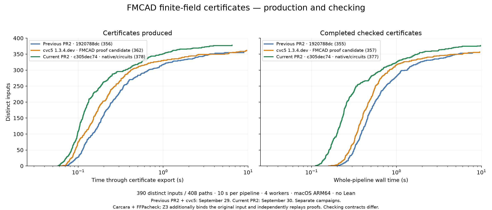
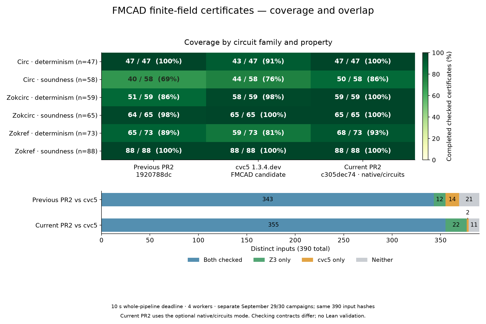
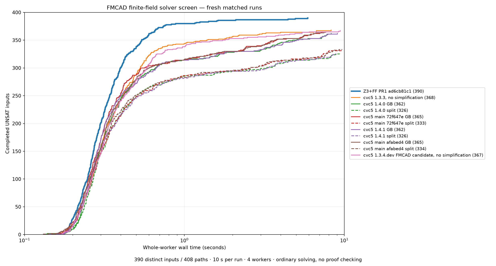
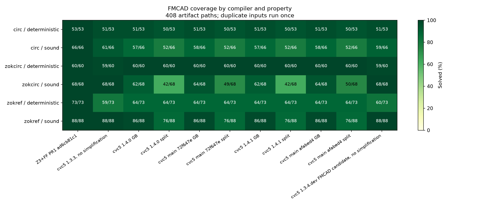

# FMCAD finite-field certificate figures — October 1, 2026

These figures accompany [PR2](https://github.com/RSoulatIOHK/z3/pull/2). The tested certificate commits were published to PR2 on October 1. These figures distinguish the previous head `1920788dc` from the current head `c305dec74`.

| Configuration | Certificates produced | Fully checked pipelines |
|---|---:|---:|
| Previous PR2 `1920788dc`, September 29 | 356/390 | 355/390 |
| cvc5 1.3.4.dev FMCAD proof candidate, September 29 | 362/390 | 357/390 |
| Current PR2 `c305dec74`, native/circuits, September 30 | 378/390 | 377/390 |

## Protocol and interpretation

The entire selected `FMCAD26 FF_UNSAT_SMT` corpus contains 408 artifact paths, deduplicated to 390 original inputs by SHA-256. Each series contains exactly one measurement per input. All runs use 10 seconds for the whole pipeline, four workers, a sampled 16 GiB process-tree RSS cap, and native macOS ARM64. Production time includes startup through export. Checked time includes the configured full checking pipeline. No Lean-SMT or Lean verification is included.

Previous PR2 and cvc5 were measured together on September 29. Current PR2 is measured by the separate September 30 final validation campaign, in four batches of 100/100/100/90 inputs. Proof bundles were compressed between batches, outside timed runs. We do not substitute repetitions or best-of timings into these curves. Host load and near-deadline variability prevent interpreting this as a controlled version-speedup experiment.

All configurations use the same pinned Carcara and FFPacheck binaries. Z3 additionally binds proofs to the original input and independently replays the polynomial derivations. Its local pipeline also invokes standalone FFPacheck before Carcara invokes FFPacheck again. The external Carcara PAC bridge does not itself bind all PAC axioms to the Alethe premise. Thus the checking contracts differ. A produced certificate is not counted as checked unless its entire pipeline succeeds.

The tested current mode is `--backend native --boolean-backend circuits`; it is optional and does not change the automatic backend policy. Its 377 checked inputs overlap the cvc5 result as follows: 355 both, 22 Z3 only, 2 cvc5 only, 11 neither. The remaining 13 Z3 inputs comprise eight Circ soundness and five Zokref determinism cases. Outcomes are 377 checked, 11 unavailable, and two timeouts (one after production), with no checker-rejection status.

The latest full validation retains all 373 successes from the previous local frontier. The four new Circ cases each checked in 3/3 repetitions while the prior mode checked 0/3. Ten proof regression suites plus build identity pass (11/11), including wrong-input and corrupted-certificate rejection. See `latest-experiment-report.txt` for the paired experiment and timing variability; paired and final validation campaigns are not combined.

The release/main cvc5 versions used in the ordinary-solving comparison reject the artifact's `--ff-proof-pac` flag. Their solving results are not presented as certificate results.

## Data and regeneration

`measurements.jsonl` records all 1,170 per-input outcomes used by the certificate figures, including input hashes, category-bearing member paths, status, production receipt and timings. `provenance.json` preserves exact source-log hashes, backend options and binary/checker/script hashes. `summary.json` contains counts, categories and overlaps. Run `python3 plot.py` with matplotlib and numpy to regenerate PNG/PDF/SVG certificate figures. The plotting script checks shared input identities and validates time/production conditions on successful results.

Full proof bundles and frozen sources remain in the separate local research archive. The native binary hash is unchanged from the preceding development milestone; the final Python source commit is `c305dec74f594444c82d036610dc81b119b9090d`. This commit is the published PR2 head as of October 1. The archived experiment report records the earlier, pre-publication state.

## Ordinary-solving reference

The unmodified `solver-solving-cactus` and `solver-coverage` figures are from the separate September 29 full solving campaign: 390 inputs × 11 configurations = 4,290 completed measurements. Z3 `ad6cb81c1` solves 390/390; cvc5 results range from 326 to 368/390. These are solver answers, not proof counts. Latest main in that campaign means pinned `afabed488b81710676fa81df408989d550779988`, not today's main. The selected corpus is UNSAT-only and does not establish broad solver superiority.

`solver-summary.json`, `solver-per-input.csv`, `solver-metadata.json`, `solver-config.json` and `solver-report.txt` preserve the corresponding measurements and methodology. A runner interruption preserved completed measurements and retried only an incomplete attempt; no completed row was replaced. The original source report explains the resume audit and dependency differences.

